# Andre Lustosa

**Principal Software Engineer at [Red Hat](https://www.redhat.com/). Building AI infrastructure for every accelerator.**

## About

- Principal Software Engineer and Team Lead at Red Hat, Ecosystems
- PhD from [North Carolina State University](https://www.ncsu.edu/) in applications of AI towards Software Engineering
- Former Software Engineering Intern at [Microsoft](https://github.com/microsoft)
- Former CTO and Lead Software Engineer at [Oceansoft](https://github.com/ocean-soft)
- BSc in Computer Science with honors from [Universidade Federal de Minas Gerais](https://ufmg.br/)

[Research](https://github.com/ai-se/andre-lustosa) | [CV](https://github.com/andre-motta/curriculum/blob/main/Motta_Resume_R1-1.pdf) | [Website](https://alustos.us)

## What I'm Building

Building AI infrastructure and agentic engineering platforms at Red Hat. My work spans validated container images for AI coding agent harnesses, automated package onboarding pipelines, and CI/CD tooling that enables teams to deploy and operate AI agents at enterprise scale.

## Tech Stack

## GitHub Stats

## Connect

