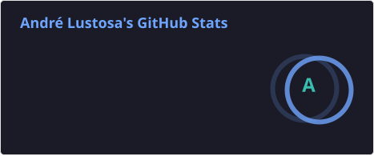
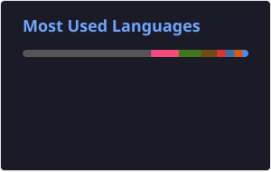

# Andre Lustosa 👋

**Principal Software Engineer & Team Lead at [Red Hat](https://www.redhat.com/)**

Software foundations · Accelerator ecosystems · Developer tools

I build reliable software platforms, lead engineering teams, and work in the open. At Red Hat, I lead engineering work on enterprise Python components and accelerator enablement, from package compatibility and cross-architecture validation to software supply chain controls.

[Website](https://alustos.us) · [CV](https://alustos.us/cv.html) · [Download CV](https://alustos.us/extra/Andre_Motta_Resume.pdf) · [LinkedIn](https://www.linkedin.com/in/andre-motta/) · [Research](https://github.com/andre-motta/research)

## What I work on

- **Software foundations:** Python packaging, source builds, dependency compatibility, and release systems that make failures easier to understand.
- **Accelerator ecosystems:** Building and validating software across CPU, CUDA, and ROCm environments.
- **Agentic engineering:** Sandboxed coding agents, observable CI workflows, and tools that help engineers review and direct their work.

## 🛠️ Projects and open source

- **[tongs](https://github.com/andre-motta/tongs)** · Creator   
  A terminal code review inbox for GitHub and GitLab, with diffs, discussions, and CI in one place.

- **[Claude Fleet Monitor](https://github.com/andre-motta/claude-fleet-monitor)** · Creator   
  A terminal dashboard for Claude Code and Codex sessions, with status tracking and a way back to the session that needs attention.

- **[agentic-ci](https://github.com/opendatahub-io/agentic-ci)** · Maintainer   
  Coding agents in sandboxed CI environments.

- **[OpenShell midstream](https://github.com/opendatahub-io/openshell)** · Midstream maintainer   
  Red Hat's maintained midstream of NVIDIA OpenShell for secure downstream builds.

- **[Fromager](https://github.com/python-wheel-build/fromager)** · Contributor & reviewer   
  Building Python dependency trees from source, with explicit build policy and useful diagnostics.

[More projects and upstream contributions →](https://alustos.us/projects.html)

## ✍️ Writing

I write about the engineering decisions behind the work: packaging, release trust, agent workflows, and tools I use myself.

- [One Review Inbox for Two Forges](https://alustos.us/blog/2026/tongs-one-review-inbox.html)
- [Bounded Autonomy Requires Separate Control Planes](https://alustos.us/blog/2026/designing-agentic-ci-bounded-autonomy.html)
- [Serving llama.cpp Across My Home Network and Tailscale](https://alustos.us/blog/2026/llama-cpp-home-network-tailscale.html)

[All writing →](https://alustos.us/archives.html)

## 🎓 Background

I earned my **PhD in Computer Science at North Carolina State University in 2025**, researching interactive search and optimization for software product-line configuration. Before Red Hat, I led software engineering at Oceansoft and interned at Microsoft. I hold a BSc in Computer Science with honors from the Federal University of Minas Gerais.

My [research repository](https://github.com/andre-motta/research) collects selected publications and archived PhD notes. See [Google Scholar](https://scholar.google.com/citations?user=lQwnqkwAAAAJ&hl=en) for additional publications and citations.

## 📊 Activity

### GitHub

### GitLab

